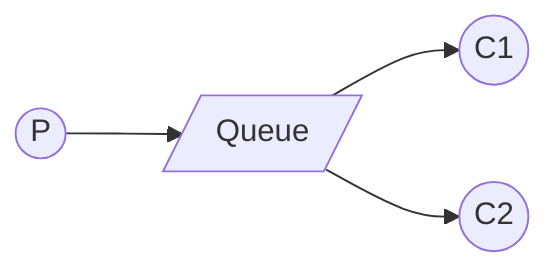

# DCC064 - Sistemas Distribuídos

## Arquitetura



## Passo 1: Rodar o RabbitMQ com a imagem do Docker

```
docker run -it --rm --name rabbitmq -p 5672:5672 -p 15672:15672 rabbitmq:3.11-management
```
